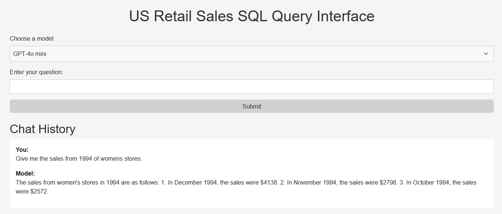

# LangChain SQL Query Assistant



## Overview

This LangChain application allows users to interact with a SQL database using natural language queries. It integrates with OpenAI's GPT models to convert user questions into SQL queries, execute them on a PostgreSQL database, and return the results.

## Features

- **Natural Language Querying**: Users can ask questions in plain language.
- **SQL Query Generation**: The app generates SQL queries based on user input using GPT models.
- **Database Interaction**: Executes queries on a PostgreSQL database and returns results.

## Requirements

Before running the app, you'll need to set up a Python virtual environment and install the required dependencies. 

## Setup

1. **Create and Activate a Virtual Environment**:
    - Navigate to your project directory and run the following commands:

      ```bash
      python -m venv venv
      ```

      To activate the virtual environment:
      - On **Windows**:

        ```bash
        venv\Scripts\activate
        ```

      - On **macOS/Linux**:

        ```bash
        source venv/bin/activate
        ```

2. **Install Dependencies**:

    - Install the dependencies by running:

      ```bash
      pip install -r requirements.txt
      ```

3. **Create a `.env` File**: This file should contain your environment variables for connecting to the PostgreSQL database and the OpenAI API. Create a `.env` file in the root directory of the project with the following content:

    ```env
    HOST=your_database_host
    PORT=your_database_port
    USERNAME=your_database_username
    PASSWORD=your_database_password
    DATABASE=your_database_name
    OPEN_AI_KEY=your_openai_api_key
    SESSION_KEY=random_str
    ```

    Replace the placeholders with your actual database and API credentials.

4. **Run the Flask App**:
    - Ensure all dependencies are installed and the virtual environment is activated.
    - Start the Flask application by running the following command:

      ```bash
      python app.py
      ```

    The app will be accessible at `http://localhost:5001`.

## Usage

- **Homepage**: Access the application at the root URL (`/`). You will see a form to submit questions and a dropdown menu to select a GPT model.
- **Submit a Question**: Enter your question and select the GPT model you want to use from the dropdown. Click 'Submit' to get an answer.
- **Model Selection**: You can choose different models that are set via the dropdown menu in `index.html`. Please note that some models, such as `gpt-4o`, may have issues generating correct SQL queries and could result in errors. If you encounter such errors, consider selecting a different model.
- **View Conversation History**: WIP

## Notes

- The SQL queries are generated with a template that ensures queries are safe and relevant to the question asked.
- **Debug Mode**: The app runs in debug mode for development. For production, consider setting `debug=False`.
- **Dataset**: In my case I used this [Dataset](https://github.com/cathytanimura/sql_book/blob/master/Chapter%203%3A%20Time%20Series%20Analysis/us_retail_sales.csv)
## Troubleshooting

- If you encounter issues, verify your `.env` file's credentials and ensure the PostgreSQL database is accessible.
- Check the Flask application logs for detailed error messages.
- For model-related errors, try using a different model from the dropdown menu if the selected one fails to generate correct SQL queries.

---

Feel free to customize and extend the application according to your needs!
